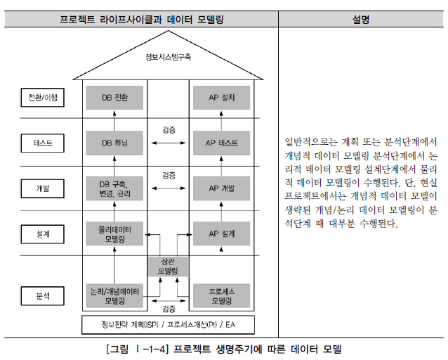
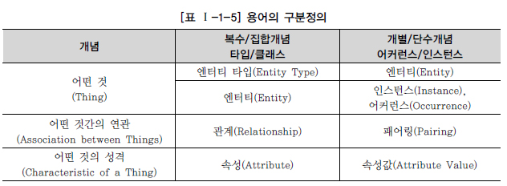
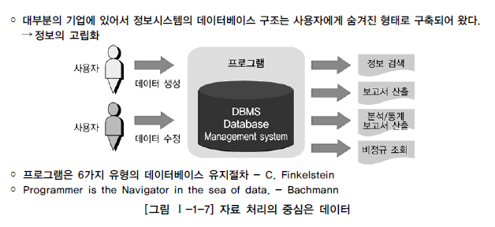
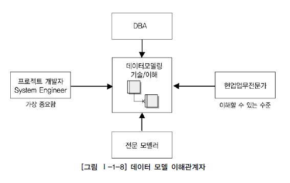
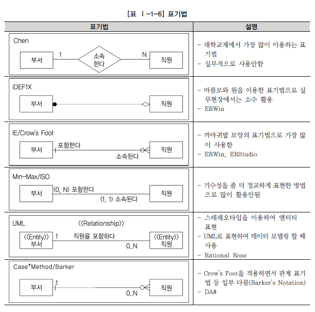
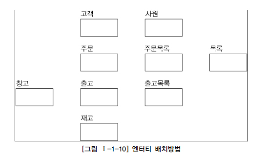
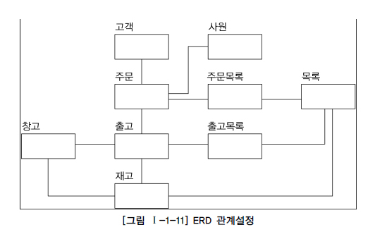

# 과목1. 데이터 모델링의 이해
# 제1장 데이터 모델링의 이해
# 제1절 데이터 모델의 이해

## 1. 모델링의 이해

### 가. 모델링의 정의
인류의 가장 보편적인 특징이면서 욕구 중의 하나는 의사소통을 하면서 항상 그에 대한 기록을 남기는 것이다. 어떤 현상에 대해 기록하고 남겨 자신 스스로 또는 다른 사람에게 적절한 의미를 주기 위해 고대부터 기록의 문화는 발전해 왔다고 할 수 있다. 모델이라고 하는 것은 모형(模型), 축소형(縮小型)의 의미로서 사람이 살아가면서 나타날 수 있는 다양한 현상에 대해서 일정한 표기법에 의해 표현해 놓은 모형이라고 할 수 있다. 이 역시 사람이 어떤 목적을 달성하기 위해 커뮤니케이션의 효율성을 극대화한 고급화된 표현방법으로 설명될 수 있다. 
사람이 살아가면서 나타날 수 있는 다양한 현상은 사람, 사물, 개념 등에 의해 발생된다고 할 수 있으며 모델링은 이것을 표기법에 의해 규칙을 가지고 표기하는 것 자체를 의미한다. 즉 모델을 만들어가는 일 자체를 모델링으로 정의할 수 있다. 

다음은 모델링에 대한 다양한 정의를 보여준다.

#### 1) 웹스터(Webster) 사전
* 가설적 또는 일정 양식에 맞춘 표현(a hypothetical OR stylized representation)
* 어떤 것에 대한 예비표현으로 그로부터 최종대상이 구축되도록 하는 계획으로서 기여하는 것

#### 2) 복잡한 '현실세계'를 단순화시켜 표현하는 것이다.

#### 3) 모델이란 사물 또는 사건에 관한 양상(Aspect)이나 관점(Perspective)을 연관된 사람이나 그룹을 위하여 명확하게 하는 것이다.

#### 4) 모델이란 현실 세계의 추상화된 반영이다.

### 나. 모델링의 특징
위의 정의를 요약하여 모델링의 특징을 요약하면 추상화, 단순화, 명확화의 3대 특징으로 요약할 수 있다.

#### 1) 추상화(모형화, 가설적)는 현실세계를 일정한 형식에 맞추어 표현을 한다는 의미로 정리할 수 있다. 즉 다양한 현상을 일정한 양식인 표기법에 의해 표현한다는 것이다.

#### 2) 단순화는 복잡한 현실세계를 약속된 규약에 의해 제한된 표기법이나 언어로 표현하여 쉽게 이해할 수 있도록 하는 개념을 의미한다.

#### 3) 명확화는 누구나 이해하기 쉽게 하기 위해 대상에 대한 애매모호함을 제거하고 정확(正確)하게 현상을 기술하는 것을 의미한다.
따라서 모델링을 다시 정의하면 '현실세계를 추상화, 단순화, 명확화하기 위해 일정한 표기법에 의해 표현하는 기법'으로 정리할 수 있다. 정보시스템 구축에서는 모델링을 계획/분석/설계 할 때 업무를 분석하고 설계하는데 이용하고 이후 구축/운영 단계에서는 변경과 관리의 목적으로 이용하게 된다.

### 다. 모델링의 세 가지 관점
시스템의 대상이 되는 업무를 분석하여 정보시스템으로 구성하는 과정에서 업무의 내용과 정보시스템의 모습을 적절한 표기법(Notation)으로 표현하는 것을 모델링이라고 한다면, 모델링은 크게 세 가지 관점인 데이터관점, 프로세스관점, 데이터와 프로세스의 상관관점으로 구분하여 설명할 수 있다. 

#### 1) 데이터 관점 : 업무가 어떤 데이터와 관련이 있는지 또는 데이터간의 관계는 무엇인지에 대해서 모델링하는 방법(What, Data)

#### 2) 프로세스 관점 : 업무가 실제하고 있는 일은 무엇인지 또는 무엇을 해야 하는지를 모델링하는 방법(How, Process)

#### 3) 데이터와 프로세스의 상관관점 : 업무가 처리하는 일의 방법에 따라 데이터는 어떻게 영향을 받고 있는지 모델링하는 방법(Interaction)
이 장에서는 데이터 모델링에 대한 기본 개념이 중요하므로 프로세스와 상관모델링에 대한 내용은 생략하고 데이터베이스를 구축하기 위한 데이터 모델링을 중심으로 설명한다.

## 2. 데이터 모델의 기본 개념의 이해

### 가. 데이터 모델링의 정의
데이터 모델은 데이터베이스의 골격을 이해하고 그 이해를 바탕으로 SQL문장을 기능과 성능적인 측면에서 효율적으로 작성하기 위해 꼭 알아야 하는 핵심요소이다. SQL 전문가를 위한 지식에서도 데이터베이스의 논리적인 구조, 즉 데이터 모델를 이해하는 것은 그 다음 SQL문장을 어떻게 구성할지에 대한 지식과 효율적인 구성에 대한 밑바탕의 지식을 쌓기 위한 핵심 이론이라 할 수 있다. 
일반적으로 데이터 모델링은 다음과 같이 다양하게 정의될 수 있다. 
* 정보시스템을 구축하기 위해, 해당 업무에 어떤 데이터가 존재하는지 또는 업무가 필요로 하는 정보는 무엇인지를 분석하는 방법
* 기업 업무에 대한 종합적인 이해를 바탕으로 데이터에 존재하는 업무 규칙(Business Rule)에 대하여 참(True) 또는 거짓(False)을 판별할 수 있는 사실(사실명제)을 데이터에 접근하는 방법(How), 사람(Who), 전산화와는 별개의(독립적인) 관점에서 이를 명확하게 표현하는 추상화 기법
이것을 좀 더 실무적으로 해석해 보면, 업무에서 필요로 하는 데이터를 시스템 구축 방법론에 따라 분석하고 설계하여 정보시스템을 구축하는 과정으로 정의할 수 있다. 
데이터 모델링을 하는 첫 번째 목적은 업무정보를 구성하는 기초가 되는 정보들을 일정한 표기법에 따라 표현함으로써 정보시스템 구축의 대상이 되는 업무 내용을 정확하게 분석하는 것이다. 두 번째는 분석된 모델을 가지고 실제 데이터베이스를 생성하여 개발 및 데이터관리에 사용하기 위함이다. 즉 데이터 모델링이라는 것은 단지 데이터베이스만을 구축하기 위한 용도로만 쓰이는 것이 아니라 데이터 모델링 자체로서 업무를 설명하고 분석하는 부분에도 매우 중요한 의미를 가지고 있다고 할 수 있다. 

### 나. 데이터 모델이 제공하는 기능
업무를 분석하는 관점에서 데이터 모델이 제공하는 기능은 다음과 같다.
* 시스템을 현재 또는 원하는 모습으로 가시화하도록 도와준다.
* 시스템의 구조와 행동을 명세화 할 수 있게 한다.
* 시스템을 구축하는 구조화된 틀을 제공한다.
* 시스템을 구축하는 과정에서 결정한 것을 문서화한다.
* 다양한 영역에 집중하기 위해 다른 영역의 세부 사항은 숨기는 다양한 관점을 제공한다.
* 특정 목표에 따라 구체화된 상세 수준의 표현방법을 제공한다.

## 3. 데이터 모델링의 중요성 및 유의점
데이터 모델링이 중요한 이유는 파급효과(Leverage), 복잡한 정보 요구 사항의 간결한 표현(Conciseness), 데이터 품질(Data Quality)로 정리할 수 있다.

### 가. 파급효과(Leverage)
시스템 구축이 완성되어 가는 시점에서는 많은 어플리케이션들의 테스트를 수행하고 대규모의 데이터 이행을 성공적으로 수행하기 위한 많은 단위 테스트들이 수행되고 이러한 과정들이 반복된다. 각 단위 테스트들이 성공적으로 완료되면 이 전체를 묶어서 병행 테스트와 통합 테스트를 수행하게 된다. 만약 이러한 시점에 데이터 모델의 변경이 불가피한 상황이 발생한다고 가정해 보자. 이를 위해서 데이터 구조의 변경에 따른 표준 영향 분석, 응용 변경 영향 분석 등 많은 영향 분석이 일어난다. 그 이후에 해당 분야의 실제적인 변경작업이 이뤄진다. 변경을 해야 하는 데이터 모델의 형태에 따라서 그 영향 정도는 차이가 있겠지만 이 시기의 데이터 구조의 변경으로 인한 일련의 변경작업은 전체 시스템 구축 프로젝트에서 큰 위험요소가 아닐 수 없다. 이러한 이유로 인해 시스템 구축 작업 중에서 다른 어떤 설계 과정보다 데이터 설계가 더 중요하다고 볼 수 있다

### 나. 복잡한 정보 요구 사항의 간결한 표현(Conciseness)
데이터 모델은 구축할 시스템의 정보 요구 사항과 한계를 가장 명확하고 간결하게 표현할 수 있는 도구이다. 정보 요구 사항을 파악하는 가장 좋은 방법은 수많은 페이지의 기능적인 요구 사항을 파악하는 것보다 간결하게 그려져 있는 데이터 모델을 리뷰하면서 파악하는 것이다. 데이터 모델은 건축물로 비유하자면 설계 도면에 해당한다. 이것은 많은 사람이 건축물 설계 도면을 공유하면서 설계자의 생각대로 일사불란하게 움직여 아름다운 건축물을 만들어 내는 것에 비유할 수 있다. 
데이터 모델은 시스템을 구축하는 많은 관련자들이 설계자의 생각대로 정보요구 사항을 이해하고 이를 운용할 수 있는 애플리케이션을 개발하고 데이터 정합성을 유지하는 것이다. 이렇게 이상적으로 역할을 할 수 있는 모델이 갖추어야 할 가장 핵심은 '정보 요구 사항이 정확하고 간결하게 표현되어야 한다'이다. 우리가 활용하고 있는 데이터 모델이 이와 같은 요소들이 충족된 모델인지를 확인해 볼 필요가 있다.

### 다. 데이터 품질(Data Quality)
데이터베이스에 담겨 있는 데이터는 기업의 중요한 자산이다. 이 데이터는 기간이 오래되면 될수록 활용가치는 훨씬 올라간다. 그런데 이러한 오래도록 저장된 데이터가 그저 그런 데이터, 정확성이 떨어지는 데이터라고 한다면 어떨까? 이것은 일부 시스템의 기능이 잘못되어 수정하는 성격의 일이 아닙니다. 이것은 해당 데이터로 얻을 수 있었던 소중한 비즈니스의 기회를 상실할 수도 있는 문제이다. 데이터 품질(Data Quality)의 문제가 중요한 이유가 여기에 있다. 데이터 품질의 문제는 데이터 구조가 설계되고 초기에 데이터가 조금 쌓일 때에는 인지하지 못하는 경우가 대부분이다. 이러한 데이터의 문제는 오랜 기간 숙성된 데이터를 전략적으로 활용하려고 하는 시점에 문제가 대두되기 때문이다. 
데이터 품질의 문제가 야기되는 중대한 이유 중 하나가 바로 데이터 구조의 때문이다. 중복 데이터의 미정의, 데이터 구조의 비즈니스 정의의 불충분, 동일한 성격의 데이터를 통합하지 않고 분리함으로써의 나타나는 데이터 불일치 등의 데이터 구조의 문제 때문에 데이터 품질 문제는 바로잡기 불가능한 경우가 대부분이다. 
데이터 모델링을 할 때 유의점은 다음과 같다.

#### 1) 중복(Duplication)
데이터 모델은 같은 데이터를 사용하는 사람, 시간, 그리고 장소를 파악하는데 도움을 준다. 이러한 지식 응용은 데이터베이스가 여러 장소에 같은 정보를 저장하는 잘못을 하지 않도록 한다.

#### 2) 비유연성(Inflexibility)
데이터 모델을 어떻게 설계했느냐에 따라 사소한 업무변화에도 데이터 모델이 수시로 변경됨으로써 유지보수의 어려움을 가중시킬 수 있다. 데이터의 정의를 데이터의 사용 프로세스와 분리함으로써 데이터 모델링은 데이터 혹은 프로세스의 작은 변화가 애플리케이션과 데이터베이스에 중대한 변화를 일으킬 수 있는 가능성을 줄인다.

#### 3) 비일관성(Inconsistency)
데이터의 중복이 없더라도 비일관성(Inconsistency)은 발생한다. 예를 들어 신용 상태에 대한 갱신 없이 고객의 납부 이력 정보를 갱신하는 것이다. 개발자가 다른 데이터와 모순된다는 고려 없이 일련의 데이터를 수정할 수 있기 때문이다. 데이터 모델링을 할 때 데이터와 데이터간 상호 연관 관계에 대한 명확한 정의는 이러한 위험을 사전에 예방할 수 있도록 해준다.

## 4. 데이터 모델링의 3단계 진행
특별히 데이터 모델은 데이터베이스를 만들어내는 설계서로서 분명한 목표를 가지고 있다. 현실세계에서 데이터베이스까지 만들어지는 과정은 [그림 Ⅰ-1-3]과 같이 시간에 따라 진행되는 과정이다. 추상화 수준에 따라 개념적 데이터 모델, 논리적 데이터 모델, 물리적 데이터 모델로 정리할 수 있다. 

처음 현실세계에서 추상화 수준이 높은 상위 수준을 형상화하기 위해 개념적 데이터 모델링을 전개한다. 개념적 데이터 모델은 추상화 수준이 높고 업무 중심적이고 포괄적인 수준의 모델링을 진행한다. 참고로 EA기반의 전사적인 데이터 모델링을 전개할 때는 더 상위 수준인 개괄적인 데이터 모델링을 먼저 수행하고 이후에 업무영역에 따른 개념적 데이터 모델링을 전개한다. 엔터티(Entity) 중심의 상위 수준의 데이터 모델이 완성되면, 업무의 구체적인 모습과 흐름에 따른 구체화된 업무 중심의 데이터 모델을 만들어 낸다. 이것을 논리적인 데이터 모델링이라고 한다. 논리적인 데이터 모델링 이후 데이터베이스의 저장 구조에 따른 테이블 스페이스 등을 고려한 방식을 물리적인 데이터 모델링이라고 한다. 
이것을 요약하여 정리하면 [표 Ⅰ-1-1]과 같다. 

### 가. 개념적 데이터 모델링
개념적 데이터베이스 설계(개념 데이터 모델링, Conceptual Data Modeling)는 조직, 사용자의 데이터 요구 사항을 찾고 분석하는데서 시작한다. 이 과정은 어떠한 자료가 중요하며 또 어떠한 자료가 유지되어야 하는지를 결정하는 것도 포함한다. 이 단계에 있어서의 주요한 활동은 핵심 엔터티와 그들 간의 관계를 발견하고, 그것을 표현하기 위해서 엔터티-관계 다이어그램을 생성하는 것이다. 엔터티-관계 다이어그램은 조직과 다양한 데이터베이스 사용자에게 어떤 데이터가 중요한지 나타내기 위해서 사용된다. 데이터 모델링 과정이 전 조직에 걸쳐 이루어진다면, 그것은 전사적 데이터 모델(Enterprise Data Model)이라고 불린다. 
개념 데이터 모델을 통해 조직의 데이터 요구를 공식화하는 것은 두 가지의 중요한 기능을 지원한다. 첫째, 개념 데이터 모델은 사용자와 시스템 개발자가 데이터 요구 사항을 발견하는 것을 지원한다. 개념 데이터 모델은 추상적이다. 그러므로 그 모델은 상위의 문제에 대한 구조화를 쉽게 하며, 사용자와 개발자가 시스템 기능에 대해서 논의할 수 있는 기반을 형성한다. 둘째, 개념 데이터 모델은 현 시스템이 어떻게 변형되어야 하는가를 이해하는데 유용하다. 일반적으로 매우 간단하게 고립된(Stand Alone) 시스템도 추상적 모델링을 통해서 보다 쉽게 표현되고 설명된다.

### 나. 논리적 데이터 모델링
논리 데이터 모델링(Logical Data Modeling)은 데이터베이스 설계 프로세스의 Input으로써 비즈니스 정보의 논리적인 구조와 규칙을 명확하게 표현하는 기법 또는 과정이라 할 수 있다. 논리 데이터 모델링의 결과로 얻어지는 논리 데이터 모델은 데이터 모델링이 최종적으로 완료된 상태라고 정의할 수 있다. 즉 물리적인 스키마 설계를 하기 전 단계의 '데이터 모델' 상태를 일컫는 말이다. 논리 데이터 모델링의 행심은 어떻게 데이터에 액세스하고, 누가 데이터에 액세스하며, 그러한 액세스의 전산화와는 독립적으로 다시 말해서 누가(Who), 어떻게(How: Process), 그리고 전산화와는 별개로 비즈니스 데이터에 존재하는 사실들을 인식하여 기록하는 것이다. 
데이터 모델링 과정에서 가장 핵심이 되는 부분이 논리 데이터 모델링이라고 할 수 있다. 데이터 모델링이란 모델링 과정이 아닌 별도의 과정을 통해 조사하고 결정한 사실을 단지 ERD라는 그림으로 그려내는 과정을 말하는 것이 아닙니다. 시스템 구축을 위해서 가장 먼저 시작할 기초적인 업무조사를 하는 초기 단계에서부터 인간이 결정해야 할 대부분의 사항을 모두 정의하는 시스템 설계의 전 과정을 지원하는 '과정의 도구'라고 해야 할 것이다. 
이 단계에서 수행하는 또 한가지 중요한 활동은 정규화이다. 정규화는 논리 데이터 모델 상세화 과정의 대표적인 활동으로, 논리 데이터 모델의 일관성을 확보하고 중복을 제거하여 속성들이 가장 적절한 엔터티에 배치되도록 함으로써 보다 신뢰성있는 데이터구조를 얻는데 목적이 있다. 논리 데이터 모델의 상세화는 식별자 확정, 정규화, M:M 관계 해소, 참조 무결성 규칙 정의 등을 들 수 있다. 또한 이력 관리에 대한 전략을 정의하여 이를 논리 데이터 모델에 반영함으로써 데이터 모델링을 완료하게 된다.

### 다. 물리적 데이터 모델링
데이터베이스 설계 과정의 세 번째 단계인 물리 데이터 모델링(Physical Data Modeling)은 논리 데이터 모델이 데이터 저장소로서 어떻게 컴퓨터 하드웨어에 표현될 것인가를 다룬다. 데이터가 물리적으로 컴퓨터에 어떻게 저장될 것인가에 대한 정의를 물리적 스키마라고 한다. 이 단계에서 결정되는 것은 테이블, 칼럼 등으로 표현되는 물리적인 저장 구조와 사용될 저장 장치, 자료를 추출하기 위해 사용될 접근 방법 등이 있다. 계층적 데이터베이스 관리 시스템 환경에서는 데이터베이스 관리자가 물리적 스키마를 설계하고 구현하기 위해서 보다 많은 시간을 투자하여야 한다. 
실질적인 현실 프로젝트에서는 개념적 데이터 모델링 → 논리적 데이터 모델링 → 물리적 데이터 모델링으로 수행하는 경우는 드물다. 개념적 데이터 모델링과 논리적 데이터 모델을 한꺼번에 수행하여 논리적인 데이터 모델링으로 수행하는 경우가 대부분이다. 프로젝트 생명주기에 따른 일반적인 데이터 모델은 다음과 같이 수행된다.

## 5. 프로젝트 생명주기에서 데이터 모델링
폭포수(Waterfall) 기반에서는 데이터 모델링의 위치가 분석과 설계단계로 구분되어 명확하게 정의할 수 있다. 정보공학이나 구조적 방법론에서는 보통 분석 단계에서 업무 중심의 논리적인 데이터 모델링을 수행하고 설계단계에서 하드웨어와 성능을 고려한 물리적인 데이터 모델링을 수행하게 된다. 나선형 모델, 예를 들어 RUP(Rational Unified Process나 마르미)에서는 업무 크기에 따라 논리적 데이터 모델과 물리적 데이터 모델이 분석-설계단계 양쪽에서 수행되며, 일반적으로 분석 단계에서 논리적인 데이터 모델이 더 많이 수행되는 형태가 된다. 

데이터 축과 애플리케이션 축으로 구분하여 프로젝트를 진행되면서 각각에 도출된 사항은 상호 검증을 지속적으로 수행하면서 단계별 완성도를 높여 간다. 단 객체지향 개념은 데이터와 프로세스를 한꺼번에 바라보면서 모델링을 전개하므로 데이터 모델링과 프로세스 모델링을 구분하지 않고 일체형으로 진행(대표적인 예가 데이터(속성)와 프로세스(Method)가 같이 있는 클래스(Class))하게 된다.

## 6. 데이터 모델링에서 데이터 독립성의 이해

### 가. 데이터 독립성의 필요성
일체적 구성에서 기능화된 구성의 가장 큰 목적은 상호간 영향에서 벗어나 개별 형식이 가지는 고유의 기능을 유지시키고 그 기능을 극대화하기 위함이다. 컴포넌트 기반의 모듈 구성도 각각이 고유한 기능을 가지면서 다른 기능을 갖고 있는 컴포넌트와 인터페이스하는 모습으로 정의할 수 있다. SOA의 '서비스'라고 하는 단위도 독립적인 비즈니스로 처리 가능한 단위를 서비스로 정의하고 그것이 다른 서비스에 비해 독립성을 구성하여 개별로도 의미를 갖고, 다른 서비스와 결합하여 프로세스로 제공해도 의미가 있는 단위(예, BPM)로 제공하는 것이다. 
이처럼 어떤 단위에 대해 독립적인 의미를 부여하고 그것을 효과적으로 구현하면, 자신이 가지는 고유한 특징을 명확하게 할 뿐만 아니라, 다른 기능의 변경으로부터 쉽게 변경되지 않고 자신의 고유한 기능을 가지고 기능을 제공할 수 있는 장점을 갖게 된다.  
데이터 독립성을 이해하기 위해서는 데이터 독립성이라는 개념의 출현 배경을 이해할 필요가 있다. 데이터 독립성의 반대말은 데이터 종속성이다. 여기에서 종속의 주체는 보통 응용(Application)을 지칭하는 경우이다. 응용은 사용자 요구 사항을 처리하는 사용자 접점의 인터페이스 오브젝트이다. 과거에 파일 방식으로 데이터를 구성할 때는 데이터가 있는 파일과 데이터에 접근하기 위한 인덱스를 별도로 구현하여 접근하게 하였다. 사용자가 접근하는 방법(트랜잭션의 유형)에 따라 파일의 정렬순서, 인덱스의 정렬순서, 파일 구성 등을 제공하기 쉽게 별도로 구성하였다. 즉 사용자 접근하는 유형에 따라 데이터를 구성하는 방법이 영향을 받게 된다. 메인프레임 환경에서 파일 방식을 사용하여 데이터를 처리했던 메인프레임 세대는 개별로 처리했던 접근 방법을 이해할 수 있으나, 1990년대 이후의 클라이언트/서버 이후 세대는 파일처리 방식 이해가 어려울 수도 있다. 
데이터 독립성은 지속적으로 증가하는 유지보수 비용을 절감하고 데이터 복잡도를 낮추며 중복된 데이터를 줄이기 위한 목적이 있다. 또한 끊임없이 나오되는 사용자 요구 사항에 대해 화면과 데이터베이스 간에 서로 독립성을 유지하기 위한 목적으로 데이터 독립성 개념이 출현했다고 할 수 있다. 

데이터 독립성은 미국 표준 협회(ANSI) 산하의 X3 위원회(컴퓨터 및 정보 처리)의 특별연구분과위원회에서 1978년에 DBMS와 그 인터페이스를 위해 제안한 'three-schema architecture'로 정의할 수 있다. 
데이터 독립성을 확보하게 되면 다음과 같은 효과를 얻을 수 있다.
* 각 뷰(View)의 독립성을 유지하고 계층별 View에 영향을 주지 않고 변경할 수 있다.
* 단계별 스키마(Schema)에 따라 데이터 정의어(DDL)와 데이터 조작어(DML)가 다름을 제공한다.
데이터 독립성을 이해하기 위해서는 3단계로 표현된 ANSI 표준 모델을 살펴볼 필요가 있다. 특히 3단계인 구조, 독립성, 사상(Mapping)의 3가지를 이해하면 된다.

### 나. 데이터베이스 3단계 구조
ANSI/SPARC의 3단계 구성의 데이터 독립성 모델은 외부 단계와 개념적 단계, 내부적 단계로 구성된 서로 간섭되지 않는 모델을 제시하고 있다. 

데이터 독립성의 3단계에서 외부단계는 사용자와 가까운 단계로 사용자 개개인이 보는 자료에 대한 관점과 관련이 있는 부분이다. 즉 사용자가 처리하고자 하는 데이터 유형, 관점, 방법에 따라 다른 스키마 구조를 가지고 있다. 개념 단계는 사용자가 처리하는 데이터 유형의 공통적인 사항을 처리하는 통합된 뷰를 스키마 구조로 디자인한 형태이다. 우리가 쉽게 이해하는 데이터 모델은 사용자가 처리하는 통합된 뷰를 설계하는 도구로 이해해도 무방하다. 마지막으로 내부적 단계는 데이터가 물리적으로 저장된 방법에 대한 스키마 구조를 말한다. 
다음 표에서 [그림 Ⅰ-1-6]의 3단계 구조의 상세 사항에 대해 각 구성별로 예를 들어 설명한다.

### 다. 데이터 독립성 요소

데이터베이스 스키마 구조는 3단계로 구분되고 각각은 상호 독립적인 의미와 고유한 기능을 가진다. 데이터 모델링은 통합 관점의 뷰를 갖는 개념 스키마를 만들어가는 과정으로 이해할 수 있다.

### 라. 두 영역의 데이터 독립성
이렇게 3단계로 개념이 분리되면서 각각의 영역에 대한 독립성을 지정하는 용어가 바로 논리적인 독립성과 물리적인 독립성이다. 

즉 논리적인 데이터 독립성은 외부의 변경에도 개념 스키마가 변하지 않는 특징을 가진다. 물론 새로운 요건이 추가되거나 삭제될 경우 칼럼이 변형될 수 있다. 하지만 이 변화가 개별 화면이나 프로세스에 의해 변화된다기 보다는 전체 업무적인 요건을 고려하여 종합적으로 영향을 받음을 의미한다.

### 마. 사상
영어로 'Mapping'은 우리말로 '사상'이라고 번역되는데 이것은 상호 독립적인 개념을 연결시켜주는 다리를 뜻한다. 데이터 독립성에서는 크게 두 가지의 사상이 도출된다. 

즉 외부 화면이나 사용자에게 인터페이스하기 위한 스키마 구조는 전체가 통합된 개념적 스키마와 연결된다는 것이 논리적 사상이다. 또한 통합된 개념적 스키마 구조와 물리적으로 저장된 구조의 물리적인 테이블 스페이스와 연결되는 구조가 물리적 사상이다. 
데이터 독립성을 보장하기 위해서는 사상을 하는 스크립트(DDL)를 DBA가 필요할 때마다 변경해 주어야 한다. 즉 각 단계(외부, 개념적, 내부적)의 독립성을 보장하기 위해서 변경사항이 발생했을 때 DBA가 적절하게 작업을 해주기 때문에 독립성이 보장된다고도 할 수 있다.

## 7. 데이터 모델링의 중요한 세 가지 개념

### 가. 데이터 모델링의 세 가지 요소
데이터 모델링을 구성하는 중요한 개념 세 가지가 있는데 이것은 데이터 모델에 대한 이해의 근간이 되므로 반드시 기억할 필요가 있다.

> 1) 업무가 관여하는 어떤 것(Things)
> 2) 어떤 것이 가지는 성격(Attributes)
> 3) 업무가 관여하는 어떤 것 간의 관계(Relationships)

이 세 가지는 데이터 모델링을 완성해 가는 핵심 개념으로서 결국 엔터티, 속성, 관계로 인식되는 것이다. 사물이나 사건 등을 바라 볼 때 전체를 지칭하는 용어를 어떤 것(Things)이라 한다. 그 어떤 것이 가지는 세부적인 사항을 성격(Attributes)이라고 할 수 있다. 또한 각각의 어떤 것은 다른 어떤 것과 연관성을 가질 수 있는데 이것을 관계(Relationship)라고 한다. 
예를 들어 '이주일과 심순애가 존재하고 둘 사이는 서로 사랑하는 연인 사이다. 이주일은 키가 180cm에 성격은 친절하고 심순애는 키가 165cm에 세심하며 활달한 성격이다'는 시나리오를 살펴보자. 여기에서 '이주일, 심순애'는 어떤 것(Things)에 해당하고 '사랑하는 연인사이'가 어떤 것 간의 관계(Relationships)에 해당한다. '180cm에 성격은 친절, 세심하며 활달함'이 어떤 것이 가지는 성격(Attributes)에 해당한다. 
위 예와 같이 이 세상의 모든 사람, 사물, 개념 등은 어떤 것, 어떤 것 간의 관계와 성격을 구분함으로써 분류할 수 있다. 바로 이러한 원리, 즉 자연계에 존재하는 모든 유형의 정보들을 세 가지 관점의 접근 방법을 통해 모델링을 진행하는 것이다.

### 나. 단수와 집합(복수)의 명명
데이터 모델링에서는 이 세 가지 개념에 대해서 단수와 복수의 개념을 분명하게 구분하고 있고 실제로 데이터 모델링을 할 때 많이 활용되는 용어이다. 

어떤 것의 전체를 표현할 때, 영문으로 Entity Set, Entity Type의 복수의 의미를 가지는 Set이나 Type을 포함하여 표현하기도 한다. 그래서 엔터티 타입으로 표현하기도 한다. 실제 실무 현장에서는 엔터티로 짧게 명명한다. 즉 엔터티는 어떤 것에 대한 집합을 명명하여 지칭한다. 어떤 것에 대한 개별 지칭으로 엔터티가 단수명사로서 의미를 갖는다. 하지만, 엔터티를 집합개념으로 사용하는 경우에는 인스턴스/어커런스를 단수의 개념으로 개별 요소를 구분한다. 관계(Relationship)도 이를 복수로 통칭하여 관계로 표현하는데, 관계에 포함된 개별 연관성을 패어링이라고 부르기도 한다. 그러나 패어링이라는 용어는 실제 데이터 모델링을 할 때는 잘 사용하지 않으며 그냥 일반적으로 단수든 복수든 '관계'라고 표현하는 경우가 많다. 어떤 것이 가지는 성격(Attribute)에 대한 집합개념이 속성이고, 그 안에 개별 값들을 속성값으로 구분하여 복수와 단수의 개념으로 구분할 수 있다. 
본 가이드에서는 현장 통용성을 반영하여 국내외적으로 가장 범용적으로 명명되고 있는 용어인 엔터티를 집합의 개념으로 지칭하고 인스턴스를 단수의 개념으로 명명하도록 한다. 
데이터 모델의 핵심 요소인 이 세 가지를 이용하여 일정한 표기법에 의해 데이터 모델을 만들어 낼 수 있다. 다음은 다양한 표기법에 의해 생성되는 데이터 모델의 표기법을 설명한다.

## 8. 데이터 모델링의 이해관계자

### 가. 이해관계자의 데이터 모델링 중요성 인식
실제 업무시스템을 구축하는 실전 프로젝트에서는 데이터베이스를 전문적으로 하는 이른바 DBA(DataBase Administrator)가 데이터 모델링을 전적으로 하는 예는 거의 없다. 오히려 업무시스템을 개발하는 응용시스템 개발자가 데이터 모델링도 같이 하게 된다. 그 이유는 데이터 모델링이라는 과정이 단지 데이터베이스를 설계한다는 측면보다 업무를 이해하고 분석하여 표현하는 것이 중요하고, 표현된 내용을 바탕으로 프로젝트 관련자와 의사소통하고 프로그램이나 다른 표기법과 비교 검증하는 일을 수행하는 등 많은 시간을 업무를 분석하고 설계하는데 할애하기 때문이다. 이에 따라 업무영역별 개발팀에서 보통 데이터 모델링을 진행하게 된다. 물론 대형 시스템이라면 모델링만을 전문적으로 담당하는 모델러를 투입하여 진행하는 경우도 있지만, 이와 같은 경우도 실제 모델링 작업은 응용 프로그램을 개발하는 사람이나 어무 분석가(역할분담이 잘되어 있을 경우)가 담당한다. 모델러나 DBA는 정확하게 모델링이 진행될 수 있도록 교육하고 제시하며 현안별로 직접 모델링을 진행하는 역할을 수행한다. 
이와 같이 응용시스템을 개발하는 모든 시스템 엔지니어가 데이터 모델을 하거나 할 기회가 있음에도 불구하고 대부분의 사람들은 데이터 모델에 많은 관심을 갖지 않는다. 대신 프로그램을 개발하기 위한 프로그래밍 언어(Programming Language)에만 많은 관심을 두고 애플리케이션  개발에 훨씬 많은 시간을 투자하는 경우가 많다. 그러나 분명한 사실은 정보시스템을 개발할 때 데이터 모델링, 데이터베이스 구축, 구축된 데이터의 적절한 활용은 다른 어떤 타스크보다 중요하다는 점이다. 

우리가 구축하려는 시스템 대부분을 데이터에 기반한, 데이터가 중심에 있는 정보시스템이기 때문에 정보시스템의 핵심에 있는 데이터베이스 설계를 잘못했을 때 미치는 영향력은 모든 프로그램, 시간에 따라 입력되는 모든 데이터, 그리고 그 데이터베이스에 발생되는 모든 트랜잭션에 영향을 미칠 수 밖에 없게 된다. 
Bachmann은 '프로그래머는 데이터집합의 탐색자'라고 하였다. 그만큼 데이터에 대한 중요성을 높게 평가하는 것이다.

### 나. 데이터 모델링의 이해관계자
그러면 누가 데이터 모델링에 대해 연구하고 학습해야 하겠는가? 
첫 번째는 정보시스템을 구축하는 모든 사람(전문적으로 코딩만하는 사람 포함)은 데이터 모델링도 전문적으로 할 수 있거나 적어도 완성된 모델을 정확하게 해석할 수 있어야 한다. 즉 프로젝트에 참여한 모든 IT기술자들은 데이터 모델링에 대해 정확하게 알고 있어야 한다. 
두 번째는 IT 기술에 종사하거나 전공하지 않았더라도 해당 업무에서 정보화를 추진하는 위치에 있는 사람도 데이터 모델링에 대한 개념 및 세부사항에 대해 어느 정도 지식을 가지고 있어야 한다. 실제 프로젝트에서 보면 업무 분석중에 현업의 업무 담당자가 어느 사이에 데이터 모델링에 대해 상당한 이해를 하고 있음을 알게 된다. 그래야만 서로가 프로젝트 수행 중에 의사소통을 잘 할 수 있고 업무를 잘못 해석하여 잘못된 시스템을 구축하는 위험(Risk)을 줄일 수 있게 된다. 업무를 가장 잘 알고 있는 사람이 가장 훌륭한 모델러가 될 수 있다는 사실을 나타내는 예이다. 

## 9. 데이터 모델의 표기법인 ERD의 이해

### 가. 데이터 모델 표기법
데이터 모델에 대한 표기법으로 1976년 피터첸(Peter Chen)이 E-R모델(Entity-relationship model)이라는 표기법을 만들었다. 엔터티를 사각형으로 표현하고 관계를 마름모, 속성을 타원형으로 표현하는 이 표기법은 데이터 모델링에 대한 이론을 배울 때 많이 활용된다. 데이터베이스 설계에 대해 우리나라 대학에서는 주로 이 첸의 모델 표기법을 통해 배우고 있다. [표 Ⅰ-1-6]은 엔터티와 속성, 그리고 관계에 대한 다양한 표기법을 설명한 것이다 

데이터아키텍처 전문가(DAP) 관련 자격에서는 바커(Barker) 표기법을 적용하여 설명했다면, 본 가이드에서는 범용적인 Information Engineering(이하 IE) 표기법과 바커 표기법을 모두 적용하여 설명한다. 표기법은 바커 표기법이든 IE 표기법이든 상호간에 기술적으로 전환이 가능하므로 한 가지만 정확하게 알고 있어도 다른 표기법을 이해하는데 큰 어려움이 없을 것이다.

### 나. ERD 표기법을 이용하여 모델링하는 방법
ERD(Entity Relationship Diagram)는 각 업무분석에서 도출된 엔터티와 엔터티간의 관계를 이해하기 쉽게 도식화된 다이어그램으로 표시하는 방법이다. 실제 프로젝트에서는 도식화된 그림 정도로만 생각하지 않고 해당 업무에서 데이터의 흐름과 프로세스와의 연관성을 이야기하는 데 가장 중요한 표기법이자 산출물로 받아들인다. 
UML 표준 표기법을 사용하는 오브젝트 모델링에서는 궁극적으로 해당 업무에 가장 적절한 클래스다이어그램을 그려내는 것이 가장 중요하다고 하면, 정보공학을 기반으로 하는 모델링에서는 해당 업무에 가장 적절한 ERD를 그려내는 것이 프로젝트의 지상과제이다. 오브젝트 모델링을 하더라도 관계형 데이터베이스를 대부분 사용하므로 데이터베이스를 생성할 수 있는 데이터 모델 생성이 프로젝트에서 아주 중요한 타스크에 포함된다. 
데이터 분석이 어느 정도 완료되면, 즉 엔터티, 관계, 속성 등이 데이터 사전이나 각종 산출물에 의해 분석된 상태에서 ERD를 그리는 것이 원래 이론적인 작업 방법이다. 하지만 실제 프로젝트에서는 분석된 엔터티와 관계, 속성 정보가 바로 ERD에 표현되며, 내부 프로젝트 인원이나 해당 업무 고객과 대화할 때 핵심 업무 산출물로 항상 이용된다. 
ERD를 그리는 것은 물론 어떻게 그리든 업무에는 전혀 지장을 주지 않지만 일정한 규칙을 지정하여 그림으로써 데이터 모델을 누구나 공통된 시각으로 파악할 수 있고 의사소통을 원활하게 할 수 있다. 
여기에서 제시하는 방법은 가이드일 뿐이며 프로젝트 상황과 엔터티의 관련 순서에 따라 얼마든지 다르게 배치될 수 있음을 숙지하고 배치 방법에 대한 원칙을 다음과 같이 설명한다. 최근에는 전문 데이터 모델링 툴을 활용하여 ERD를 그리게 되므로 다음과 같이 엔터티, 속성, 관계 순으로 진행하기 보다는 엔터티와 관계를 바로 표현하는 방식으로 진행하기도 한다. 다만 업무를 분석하여 무엇을 도출할 지에 대한 관점을 제시하고, 전문 데이터 모델링 툴이 없을 때 어떤 순서로 표현해야 하는지 알 수 있도록 방법을 설명한다.

#### 1) ERD 작업순서
ERD를 작성하는 작업순서는 다음과 같다. 
① 엔터티를 그린다. ② 엔터티를 적절하게 배치한다. ③ 엔터티간 관계를 설정한다. ④ 관계명을 기술한다. ⑤ 관계의 참여도를 기술한다. ⑥ 관계의 필수여부를 기술한다. 

ERD는 엔터티와 엔터티 사이의 관계가 있는 정보를 나타내므로 두 개를 이용하여 작성하고, 이에 따라 Primary Key와 Foreign Key를 ERD 규칙에 따라 기술하도록 한다. 엔터티는 사각형으로 표기하여 기술한다.

#### 2) 엔터티 배치
엔터티를 처음에 어디에 배치하는지는 데이터 모델링 툴을 사용하든 사용하지 않던 중요한 문제이다. 일반적으로 사람의 눈은 왼쪽에서 오른쪽, 위 쪽에서 아래쪽으로 이동하는 경향이 있다. 따라서 데이터 모델링에서도 가장 중요한 엔터티를 왼쪽상단에 배치하고, 이것을 중심으로 다른 엔터티를 나열하면서 전개하면 사람의 눈이 따라가기에 편리한 데이터 모델링을 전개할 수 있다. 해당 업무에서 가장 중요한 엔터티는 왼쪽 상단에서 조금 아래쪽 중앙에 배치하여 전체 엔터티와 어울릴 수 있도록 하면, 향후 관계를 연결할 때 선이 꼬이지 않고 효과적으로 배치할 수 있다. 

[그림 Ⅰ-1-10]의 데이터 모델에서도 가장 중요한 엔터티인 고객과 주문을 왼쪽 상단에 배치하여 다른 엔터티를 연결하는 방식으로 그렸다. 주문에 따라 출고가 이루어졌으므로 주문이 위에 출고가 아래에 위치해 있다. 
두 번째 업무흐름에 중심이 되는 엔터티, 보통 업무 흐름에 있어서 중심이 되는 엔터티는 타 엔터티와 많은 관계를 가지고 있으므로 중앙에 배치하도록 한다. [그림 Ⅰ-1-10]에서는 주문, 출고, 주문목록, 출고목록이 업무의 중심엔터티에 해당한다. 
세 번째는 업무를 진행하는 중심엔터티와 관계를 갖는 엔터티들은 중심에 배치된 엔터티를 주위에 배치하도록 한다. [그림 Ⅰ-1-10]에서는 창고, 고객, 사원, 재고가 이에 해당한다.

#### 3) ERD 관계 연결
엔터티에 배치가 되면 관계를 정의한 분석서를 보고 서로 관련있는 엔터티간에 관계를 설정하도록 한다. 초기에는 모두 Primary Key로 속성이 상속되는 식별자 관계를 설정하도록 한다. 중복되는 관계가 발생되지 않도록 하고 Circle 관계도 발생하지 않도록 유의하여 작성하도록 한다. 

#### 4) ERD 관계명의 표시
관계설정이 완료되면 연결된 관계에 관계 이름을 부여하도록 한다. 관계 이름은 현재형을 사용하고 지나치게 포괄적인 용어(예, 이다, 가진다 등)는 사용하지 않도록 한다. 

실제 프로젝트에서는 관계의 명칭을 크게 고려하지 않아도 무방하다. 왜냐하면 관계의 명칭이 나타나지 않아도 ERD의 흐름이 명확하게 드러나기 때문이다. 대부분의 관계는 엔터티의 성질과 주식별자를 보고 유추할 수 있다.

#### 5) ERD 관계 관계차수와 선택성 표시
관계에 대한 이름을 모두 지정하였으면 관계가 참여하는 성격 중 엔터티내에 인스턴스들이 얼마나 관계에 참여하는 지를 나타내는 관계차수(Cardinality)를 표현한다. [그림 Ⅰ-1-13]은 관계의 관계차수를 지정한 ERD의 모습을 보여준다. 관계설명에서도 언급하겠지만 IE표기법으로는 하나(1, One)의 관계는 실선으로 표기하고 Barker표기법으로는 점선과 실선을 혼합하여 표기한다. 다수참여(Many)의 관계는 까마귀발과 같은 모양으로 그려준다. 또한 관계의 필수/선택표시는 관계선에 원을 표현하여 ERD를 그리도록 한다. 

## 10. 좋은 데이터 모델의 요소
일반적으로 시스템 구축 과정에서 생성되는 데이터 모델은 그 품질을 평가하는 것이 매우 어렵다. 사실 특정 데이터 모델이 업무 환경에서 요구하는 사항을 얼마나 잘 시스템적으로 구현할 수 있는가를 객관적으로 평가할 수 있다면 가장 좋은 평가의 방법일 것이다. 하지만 어디에도 이것을 객관적으로 평가할 수 있는 기준이 존재하지는 않는 것이 현실이다. 본 가이드에서는 이러한 상황에서 대체적으로 좋은 데이터 모델이라고 말할 수 있는 몇 가지의 요소들을 설명한다.

### 가. 완전성
업무에서 필요로 하는 모든 데이터가 데이터 모델에 정의되어 있어야 한다(Completeness). 데이터 모델을 검증하기 위해서 가장 먼저 확인해야 할 부분이다. 이 기준이 충족되지 못하면, 다른 어떤 평가 기준도 의미가 없어진다. 만약, 보험사의 데이터 모델에 고객의 직업을 관리하기 위한 속성이 존재하지 않는다면 어떨까? 이것은 심각한 데이터 모델의 문제점이다.

### 나. 중복배제
하나의 데이터베이스 내에 동일한 사실은 반드시 한 번만 기록하여야 한다(Non-Redundancy). 예를 들면, 하나의 테이블에서 '나이' 칼럼과 '생년월일' 칼럼이 동시에 존재한다면, 이것은 데이터 중복이라 볼 수 있다. 이러한 형태의 데이터 중복 관리로 때문에 여러 가지 바람직하지 않은 형태의 데이터 관리 비용을 지불할 수 있다. 예를 들면 저장공간, 중복 관리되는 데이터의 일관성을 유지하기 위한 추가적인 데이터 조작 등이 대표적으로 낭비되는 비용이라고 볼 수 있다.

### 다. 업무규칙(Business Rules)
데이터 모델에서 매우 중요한 요소 중 하나가 데이터 모델링 과정에서 도출되고 규명되는 수많은 업무규칙(Business Rules)을 데이터 모델에 표현하고 이를 해당 데이터 모델을 활용하는 모든 사용자가 공유할 수 있도록 제공하는 것이다. 특히, 데이터 아키텍처에서 언급되는 논리 데이터 모델에서 이러한 요소들이 포함되어야 함은 매우 중요하다. 예를 들면 보험사의 사원들은 매월 여러 가지 항목에 대해서 급여를 지급받는데, 이를 데이터로 관리하고 있다. 각 사원들은 월별로 하나 이상의 급여 항목(기본급, 상여금, 수당, 수수료, 등등)에 대해서 급여를 지급받는다. 여기에 더 나아가 각 사원은 사원 구분별(내근, 설계사, 계약직, 대리점 등)로 위의 급여 항목을 차등적으로 지급받는 다는 업무규칙이 있다. 이러한 내용을 데이터 모델에 나타내야 한다. 이렇게 함으로써 해당 데이터 모델을 사용하는 모든 사용자(개발자, 관리자 등)가 해당 규칙에 대해서 동일한 판단을 하고 데이터를 조작할 수 있게 된다.

### 라. 데이터 재사용(Data Reusability)
데이터의 재사용성을 향상시키고자 한다면 데이터의 통합성과 독립성에 대해서 충분히 고려해야 한다. 과거에 정보시스템이 생성·운영된 형태를 되짚어 보면 철저하게 부서 단위의 정보시스템으로 설계되고 운용되어 왔다. 현재 대부분의 회사에서 진행하고 있는 신규 정보시스템의 구축 작업은 회사 전체 관점에서 공통 데이터를 도출하고 이를 전 영역에서 사용하기에 적절한 형태로 설계하여 시스템을 구축하게 된다. 이러한 형태의 데이터 설계에서 가장 중요하게 대두되는 것이 통합 모델이다. 통합 모델이어야만 데이터 재사용성을 향상시킬 수 있다. 또 한 측면에서 보면 과거 정보시스템의 데이터 구조의 가장 큰 특징은 데이터 모델이 별도로 존재하지 않고 애플리케이션의 부속품 정도로 인식되어져 왔던 것이 사실이다. 이러한 환경에서의 데이터는 프로세스의 흐름에 따라서 관리되게 마련이다. 이렇게 되면 데이터 중복이 많이 발생하고 데이터의 일관성 문제가 심각하게 초래된다. 데이터가 애플리케이션에 대해 독립적으로 설계되어야만 데이터 재사용성을 향상시킬 수 있다. 정보시스템은 비즈니스의 변화에 대해서 최적으로 적응하도록 끊임없이 요구된다. 하지만 일부 정보시스템의 데이터 모델은 이러한 변화에 대해서 현재의 데이터 구조를 거의 변화하지 않고도 변화에 대응할 수 있는 데이터 구조도 있을 것이고, 아주 적은 확장을 통해서 이러한 변화에 대응하는 것도 있을 것이다. 하지만, 이러한 변화에 대응하기 위해서 데이터 구조적으로 아주 많은 변화를 주어야만 한다면 변화의 대상이 되는 부분뿐만 아니라 정보시스템의 나머지 부분들도 많은 영향을 받게 될 것이다. 그래서 많은 기업들이 정보시스템을 구축하는 과정에서 데이터 구조의 확장성, 유연성에 많은 노력을 기울이고 있다. 결국 현대의 기업들이 동종의 타 기업으로부터 경쟁 우위에 자리매김하려고 하다면 구축하는 데이터 모델은 이러한 외부의 업무 환경 변화에 대해서 유연하게 대응할 수 있어야 한다. 특히 근래의 많은 패키지 시스템들이 가지고 있는 데이터 모델들은 확장성을 강조하기 위해서 많은 부분을 통합한 데이터 모델의 형태를 가지고 있다. 여기에서도 잘 나타나듯이 확장성을 담보하기 위해서는 데이터 관점의 통합이 불가피하다. 특히 정보시스템에서의 '행위의 주체'가 되는 집합의 통합, '행위의 대상'이 되는 집합의 통합, '행위 자체'에 대한 통합 등은 전체 정보시스템의 안정성, 확장성을 좌우하는 가장 중요한 요소이다? 하나는 기업이 관리하고자 하는 데이터를 합리적으로 균형이 있으면서도 단순하게 분류하는 것이다. 아무리 효율적으로 데이터를 잘 관리할 수 있다고 하더라도 그것의 사용, 관리 측면이 복잡하다면 잘 만들어진 데이터 모델이라고 할 수 없다. 동종의 비즈니스를 영위하는 기업이라 하더라도 각 회사의 데이터 모델을 비교해 보면 그 복잡도에는 많은 차이를 나타낸다. A보험사는 계약 업무를 수행하기 위해서 10개의 테이블을 정의하여 업무를 수행하는 반면에 B회사는 100개의 테이블을 정의하여 동일한 업무를 수행하고 있다. 두 회사의 데이터 모델의 차이점은 다음과 같다. 10개의 테이블을 가지고 업무를 수행하고 있는 A회사의 데이터 모델은 간결하지만 새로는 업무 환경의 변화에 대해서 확장성을 가지고 있다. B회사는 겉으로는 새로운 업무 환경의 변화터 모델의 한계로 인해 테이블의 수가 지속적으로 증가해 왔다. 이렇게 됨으로써 데이터 모델은 간결하지 못하고 동일한 형태로 관리되어야 하는 데이터가 복잡한 형태로 관리되고 그들과의 관계를 가지고 있는 다른 여러 가지의 데이터들 또한 복잡한 형태의 관계들이 불가피 기본적인 전제는 통합이다. 합리적으로 잘 정돈된 방법으로 데이터를 통합하여 데이터의 집합을 정의하고 이를 데이터 모델로 잘 표현하여 활용한다면 웬만한 업무 변화에도 데이터 모델이 영향을 받지 않고 운용할 수 있게 된다.

### 마. 의사소통(Communication)

데이터 모델의 역할은 많다. 그 중에서도 중요한 것이 데이터 모델의 의사소통의 역할이다. 데이터 모델은 대상으로 하는 업무를 데이터 관점에서 분석하고 이를 설계하여 나오는 최종 산출물이다. 데이터를 분석 과정에서는 자연스럽게 많은 업무 규칙들이 도출된다. 이 과정에서 도출되는 많은 업무 규칙들은 데이터 모델에 엔터티, 서브타입, 속성, 관계 등의 형태로 최대한 자세하게 표현되어야 한다. 예를 들면, '사원' 테이블에는 어떠한 '사원구분'을 가지는 사원들이 존재하는지, '정규직', '임시직' 사원들이 같이 존재하는지, 아니면 또 다른 형태의 사원들이 존재하는지를 표현해야 한다. 더 나아가서 '호봉'이라는 속성은 '정규직'일 때에만 존재하는 속성인데 이러한 업무 규칙이 데이터 모델에 표현되어야 한다. 또한, 우리가 관리하는 사원들 중에서 '정규직' 사원들만이 '급여' 테이블과 관계를 가진다. 이러한 부분은 개별 관계로 데이터 모델에 표현되어야 한다. 이렇게 표현된 많은 업무 규칙들을 해당 정보시스템을 운용, 관리하는 많은 관련자들이 설계자가 정의한 업무 규칙들을 동일한 의미로 받아들이고 정보시스템을 활용할 수 있게 하는 역할을 하게 된다. 즉 데이터 모델이 진정한 의사소통(Communication)의 도구로서의 역할을 하게 된다.

### 바. 통합성(Integration)

기업들이 과거부터 정보시스템을 구축해 왔던 방법은 개별 업무별로의 단위 정보시스템을 구축하여 현재까지 유지보수를 해오고 있는 것이 보통이다. 점진적인 확장과 보완의 방법으로 정보시스템을 구축해 왔기 때문에 동일한 성격의 데이터임에도 불구하고 전체 조직관점에서 보면 여러 곳에서 동일한 데이터가 존재하기 마련이다. 특히 이러한 데이터 중에서도 고객, 상품 등과 같이 마스터 성격의 데이터들이 분할되어 관리됨으로 인해 전체 조직 관점에서 데이터 품질, 관리, 활용 관점에서 많은 문제점들이 나타나고 있는 것이 현실이다. 가장 바람직한 데이터 구조의 형태는 동일한 데이터는 조직의 전체에서 한번 만 정의되고 이를 여러 다른 영역에서 참조, 활용하는 것이다. 물론 이 때에 성능 등의 부가적인 목적으로 의도적으로 데이터를 중복시키는 경우는 존재할 수 있다. 동일한 성격의 데이터를 한 번만 정의하기 위해서는 공유 데이터에 대한 구조를 여러 업무 영역에서 공동으로 사용하기 용이하게 정의할 수 있어야 한다. 이러한 이유로 데이터 아키텍처의 중요성이 한층 더 부각되고 있다.

> 출처 : 한국데이터산업진흥원 데이터온에어([https://dataonair.or.kr](https://dataonair.or.kr))