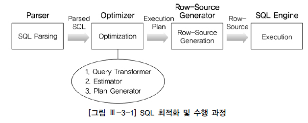
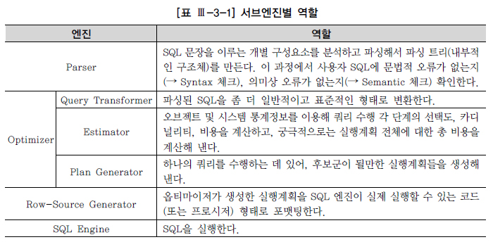

# 과목3. SQL 고급 활용 및 튜닝
# 제1장 SQL 수행 구조
# 제2절 SQL 처리 과정

## 1. 구조적, 집합적, 선언적 질의 언어

## 2. SQL 처리 과정
Oracle 기준으로, SQL 최적화 및 수행 과정을 좀 더 자세히 표현하면 [그림 Ⅲ-3-1]과 같다.<br>



[표 Ⅲ-3-1]은 [그림 Ⅲ-3-1]에 표현된 각 서브엔진의 역할을 요약한 것이다.<br>



Oracle 뿐만 아니라 다른 DBMS도 비슷한 처리과정을 통해 실행계획을 생성한다. 참고로 M.Jarke와 J.Koch가 펴낸 "Query Optimization in Database Systems"를 보면, 쿼리 최적화 과정을 다음과 같이 설명하고 있는데, [그림 Ⅲ-3-1]과 [표 Ⅲ-3-1]에서 설명한 Parser와 Optimizer 역할에 해당하는 내용임을 알 수 있다.<br>

* 쿼리를 내부 표현방식으로 변환
* 표준적인(canonical) 형태로 변환
* 후보군이 될만한 (낮은 레벨의) 프로시저를 선택
* 실행계획을 생성하고, 가장 비용이 적은 것을 선택

## 3. SQL 옵티마이저
옵티마이저(Optimizer)는 SQL을 가장 빠르고 효율적으로 수행할 최적(최저비용)의 처리경로를 생성해 주는 DBMS 내부의 핵심엔진이다. 사용자가 구조화된 질의언어(SQL)로 결과집합을 요구하면, 이를 생성하는데 필요한 처리경로는 DBMS에 내장된 옵티마이저가 자동으로 생성해준다. 옵티마이저가 생성한 SQL 처리경로를 실행계획(Execution Plan)이라고 부른다. 옵티마이저의 SQL 최적화 과정을 요약하면 다음과 같다.<br>

* 사용자가 던진 쿼리수행을 위해, 후보군이 될만한 실행계획을 찾는다.
* 데이터 딕셔너리(Data Dictionary)에 미리 수집해 놓은 오브젝트 통계 및 시스템 통계정보를 이용해 각 실행계획의 예상비용을 산정한다.
* 각 실행계획을 비교해서 최저비용을 갖는 하나를 선택한다.

## 4. 실행계획과 비용

## 5. 옵티마이저 힌트
통계정보가 정확하지 않거나 기타 다른 이유로 옵티마이저가 잘못된 판단을 할 수 있다. 그럴 때 프로그램이나 데이터 특성 정보를 정확히 알고 있는 개발자가 직접 인덱스를 지정하거나 조인 방식을 변경함으로써 더 좋은 실행계획으로 유도하는 메커니즘이 필요한데, 옵티마이저 힌트가 바로 그것이다. 힌트 종류와 구체적인 사용법은 DBMS마다 천차만별이다. 지면 관계상 모두 다룰 수 없으므로 Oracle과 SQL Server에 대해서만 설명하기로 한다.

### 가. Oracle 힌트

#### 1) 힌트 기술 방법

Oracle에서 힌트를 기술하는 방법은 다음과 같다.

>```sql
>SELECT /*+ LEADING(e2 e1) USE_NL(e1) INDEX(e1 emp_emp_id_pk) USE_MERGE(j) FULL(j) */
>       E1.FIRST_NAME
>     , E1.LAST_NAME
>     , J.JOB_ID
>     , SUM(E2.SALARY) total_sal
>  FROM EMPLOYEES E1
>     , EMPLOYEES E2
>     , JOB_HISTORY J
> WHERE E1.EMPLOYEE_ID = E2.MANAGER_ID
>   AND E1.EMPLOYEE_ID = J.EMPLOYEE_ID
>   AND E1.HIRE_DATE = J.START_DATE
> GROUP BY E1.FIRST_NAME
>          , E1.LAST_NAME
>          , J.JOB_ID
> ORDER BY TOTAL_SAL; 
>```

#### 2) 힌트가 무시되는 경우

다음과 같은 경우에 Oracle 옵티마이저는 힌트를 무시하고 최적화를 진행한다.<br>

* 문법적으로 안 맞게 힌트를 기술<br>
* 의미적으로 안 맞게 힌트를 기술 : 예를 들어, 서브쿼리에 unnest와 push_subq를 같이 기술한 경우(unnest되지 않은 서브쿼리만이 push_subq 힌트의 적용 대상임)<br>
* 잘못된 참조 사용 : 없는 테이블이나 별칭(Alias)을 사용하거나, 없는 인덱스명을 지정한 경우 등<br>
* 논리적으로 불가능한 액세스 경로 : 조인절에 등치(=) 조건이 하나도 없는데 Hash Join으로 유도하거나, 아래 처럼 null 허용칼럼에 대한 인덱스를 이용해 전체 건수를 세려고 시도하는 등

>```sql
>SELECT /*+ index(e emp_ename_idx) */ COUNT(*)
>  FROM EMP E 
>```

* 버그<br>
위 경우에 해당하지 않는 한 옵티마이저는 힌트를 가장 우선적으로 따른다. 즉 옵티마이저는 힌트를 선택 가능한 옵션 정도로 여기는 게 아니라 사용자로부터 주어진 명령어(directives)로 인식한다. 여기서 주의할 점이 있다. Oracle은 사용자가 힌트를 잘못 기술하거나 잘못된 참조를 사용하더라도 에러가 발생하지 않는다는 사실이다. 힌트와 관련한 Oracle의 이런 정책은 프로그램 안정성 측면에 도움이 되는가 하면, 성능 측면에서 불안할 때도 있다. 예를 들어, 힌트에 사용된 인덱스를 어느 날 DBA가 삭제하거나 이름을 바꾸었다고 하자. 그럴 때 SQL Server에선 에러가 발생하므로 해당 프로그램을 수정하고 다시 컴파일해야 한다. 프로그램을 수정하다 보면 인덱스 변경이 발생했다는 사실을 발견하게 되고, 성능에 문제가 생기지 않도록 적절한 조치를 취할 것이다. 반면, Oracle에선 프로그램을 수정할 필요가 없어 좋지만 내부적으로 Full Table Scan하거나 다른 인덱스가 사용되면서 성능이 갑자기 나빠질 수 있다. 애플리케이션 운영자는 사용자가 불평하기 전까지 그런 사실을 알지 못하며, 사용 빈도가 높은 프로그램에서 그런 현상이 발생해 시스템이 멎기도 한다. DBMS마다 이처럼 차이가 있다는 사실을 미리 숙지하고, 애플리케이션 특성(안정성 우선, 성능 우선 등)에 맞게 개발 표준과 DB 관리정책을 수립할 필요가 있다.

#### 3) 힌트 종류

Oracle은 공식적으로 아래와 같이 많은 종류의 힌트를 제공하며, 비공식 힌트까지 합치면 150여 개에 이른다. 비공식 힌트까지 모두 알 필요는 없지만, 최소한 [표 Ⅲ-3-4]에 나열한 힌트는 그 용도와 사용법을 숙지할 필요가 있다. 자세한 설명은 Oracle 매뉴얼을 참조하기 바란다.<br>


### 나. SQL Server 힌트

SQL Server에서 옵티마이저 힌트를 지정하는 방법으로는 크게 3가지가 있다.<br>

* 테이블 힌트<br>
테이블명 다음에 WITH절을 통해 지정한다. fastfirstrow, holdlock, nolock 등<br>
* 조인 힌트<br>
FROM절에 지정하며, 두 테이블 간 조인 전략에 영향을 미친다. loop, hash, merge, remote 등<br>
* 쿼리 힌트<br>
쿼리당 맨 마지막에 한번만 지정할 수 있는 쿼리 힌트는 아래와 같이 OPTION절을 이용한다.<br>

앞에서 설명했듯이, SQL Server는 문법이나 의미적으로 맞지 않게 힌트를 기술하면 프로그램에 에러가 발생한다.


###### 출처 : 한국데이터산업진흥원 데이터온에어([https://dataonair.or.kr](https://dataonair.or.kr))