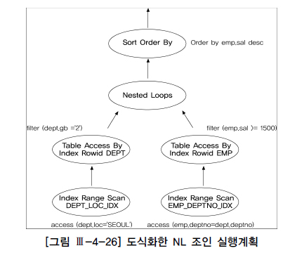
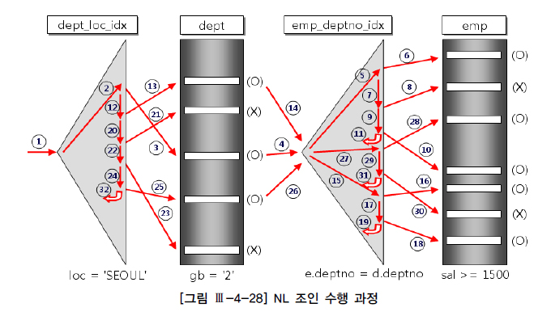

# 과목3. SQL 고급 활용 및 튜닝
# 제4장 조인 튜닝
# 제1절 NL 조인


## 1. 기본 메커니즘

프로그래밍을 해 본 독자라면 누구나 아래 중첩 루프문(Nested Loop)의 수행 구조를 이해할 것이고, 그렇다면 Nested Loop Join(이하 NL Join)도 어렵지 않게 이해할 수 있다.

>```java
>< C, JAVA >
>for(i=0; i<100; i++){ -- outer loop
>   for(j=0; j<100;j++){ -- inner loop
>     // Do Anything ... 
>   }
> }
>```

위 중첩 루프문과 같은 수행 구조를 사용하는 NL Join이 실제 어떤 순서로 데이터를 액세스하는지 아래 PL/SQL문이 잘 설명해 준다.

>```sql
>BEGIN
>    FOR OUTER IN (SELECT DEPTNO
>                         , EMPNO
>                         , RPAD(ENAME, 10) ename
>                    FROM EMP) LOOP -- outer 루프
>        FOR INNER IN (SELECT DNAME
>                        FROM DEPT
>                       WHERE DEPTNO = OUTER.DEPTNO) LOOP -- inner 루프
>            DBMS_OUTPUT.PUT_LINE(OUTER.EMPNO
>                                 || ' : '
>                                 || OUTER.ENAME
>                                 || ' : '
>                                 || INNER.DNAME);
>        END LOOP;
>    END LOOP;
>END; 
>```

위 PL/SQL문은 아래 쿼리와 100% 같은 순서로 데이터를 액세스하고, 데이터 출력순서도 같다. 내부적으로(=Recursive하게) 쿼리를 반복 수행하지 않는다는 점만 다르다.

###### [예제] Oracle

>```sql
>SELECT /*+ ordered use_nl(d) */ E.EMPNO
>                                , E.ENAME
>                                , D.DNAME
>  FROM EMP E
>     , DEPT D
> WHERE D.DEPTNO = E.DEPTNO
>
>SELECT /*+ leading(e) use_nl(d) */ E.EMPNO
>                                   , E.ENAME
>                                   , D.DNAME
>  FROM DEPT D
>     , EMP E
> WHERE D.DEPTNO = E.DEPTNO 
>```
> [예제] SQL Server
>```sql
>SELECT E.EMPNO
>     , E.ENAME
>     , D.DNAME
>  FROM EMP E
>       INNER LOOP JOIN DEPT D
>                    ON D.DEPTNO = E.DEPTNO
>OPTION (FORCE ORDER)
>
>SELECT E.EMPNO
>     , E.ENAME
>     , D.DNAME
>  FROM EMP E
>     , DEPT D
> WHERE D.DEPTNO = E.DEPTNO
>OPTION ( FORCE ORDER, LOOP JOIN ) 
>```

사실 뒤에서 설명할 Sort Merge Join과 Hash Join도 각각 소트 영역(Sort Area)과 해시 영역(Hash Area)에 가공해 둔 데이터를 이용한다는 점만 다를 뿐 기본적인 조인 프로세싱은 다르지 않다.

## 2. NL Join 수행 과정 분석

이제 NL Join의 기본 메커니즘을 이해했으므로 아래 조인문에서 조건절 비교 순서가 어떻게 되는지 분석해 보자.

>```sql
>SELECT /*+ ordered use_nl(e) */
>       e.empno
>     , e.ename
>     , d.dname
>     , e.job
>     , e.sal
>  FROM dept d
>     , emp e
> WHERE e.deptno = d.deptno -- …………… ①
>   AND d.loc = 'SEOUL'     -- …………… ②
>   AND d.gb = '2'          -- …………… ③
>   AND e.sal >= 1500       -- …………… ④
> ORDER BY sal desc
>```

인덱스 상황은 다음과 같다.

> * pk_dept : dept.deptno
> * dept_loc_idx : dept.loc
> * pk_emp : emp.empno 
> * emp_deptno_idx : emp.deptno
> * emp_sal_idx : emp.sal

조건절 비교 순서, 그리고 위 5개 인덱스 중 어떤 것이 사용될지도 함께 고민해 보기 바란다.

>
>|   |   |         Execution Plan         |
>|--:|--:|--------------------------------|
>|  0|   |SELECT STATEMENT                |
>|  1|  0|SORT ORDER BY                   |
>|  2|  1|NESTED LOOPS                    |
>|  3|  2|TABLE ACCESS BY INDEX ROWID DEPT|
>|  4|  3|INDEX RANGE SCAN DEPT_LOC_IDX   |
>|  5|  2|TABLE ACCESS BY INDEX ROWID EMP |
>|  6|  5|INDEX RANGE SCAN EMP_DEPTNO_IDX |
>

사용되는 인덱스는 dept_loc_idx와 emp_deptno_idx 인 것을 위 실행계획을 보고 알 수 있다. 그럼 조건비교 순서는? SQL 조건절에 표시한 번호로 ② → ③ → ① → ④ 순이다. 실행계획을 해석할 때, 형제(Sibling) 노드 간에는 위에서 아래로 읽는다. 부모-자식(Parent-Child) 노드 간에는 안쪽에서 바깥쪽으로, 즉 자식 노드부터 읽는다. 위 실행계획의 실행 순서를 나열하면 다음과 같다.<br>

1. dept_loc_idx 인덱스 범위 스캔(ID = 4) 
2. 인덱스 rowid로 dept 테이블 액세스(ID = 3)
3. emp_deptno_idx 인덱스 범위 스캔(ID = 6)
4. 인덱스 rowid로 emp 테이블 액세스(ID = 5)
5. sal 기준 내림차순(desc) 정렬(ID = 1)

위 실행계획을 그림으로써 표현해 보면 [그림 Ⅲ-4-26]과 같다.<br>



[그림 Ⅲ-4-26]을 해석할 때는, 형제 노드 간에는 좌에서 우로 읽고, 부모-자식 노드 간에는 아래에서 위쪽으로, 즉 자식 노드부터 읽는다.<br>

1. dept.loc = 'SEOUL' 조건을 만족하는 레코드를 찾으려고 dept_loc_idx 인덱스를 범위 스캔한다.
2. dept_loc_idx 인덱스에서 읽은 rowid를 가지고 dept 테이블을 액세스해 dept.gb = '2' 필터 조건을 만족하는 레코드를 찾는다. 
3. dept 테이블에서 읽은 deptno 값을 가지고 조인 조건을 만족하는 emp 쪽 레코드를 찾으려고 emp_deptno_idx 인덱스를 범위 스캔한다.
4. emp_deptno_idx 인덱스에서 읽은 rowid를 가지고 emp 테이블을 액세스해 sal >= 1500 필터 조건을 만족하는 레코드를 찾는다.
5. 1~4 과정을 통과한 레코드들을 sal 칼럼 기준 내림차순(desc)으로 정렬한 후 결과를 리턴한다.

여기서 기억할 것은, 각 단계를 완료하고 나서 다음 단계로 넘어가는 게 아니라 한 레코드씩 순차적으로 진행한다는 사실이다. 단, ORDER BY는 전체 집합을 대상으로 정렬해야 하므로 작업을 모두 완료하고서 다음 오퍼레이션을 진행한다. 아래는 SQL Server에서의 실행계획이다.

>|                                    StmtText                                    |
>|--------------------------------------------------------------------------------|
>|--Sort(ORDER BY:([e].[sal] DESC))                                               |
>| \| --Filter(WHERE:([emp].[sal] as [e].[sal]>=(1500)))                            |
>| \| --Nested Loops(Inner Join, OUTER REFERENCES:([Bmk1003]))                      |
>| \| --Nested Loops(Inner Join, OUTER REFERENCES:([d]>.[deptno]>))                 |
>| \| \| --Filter(WHERE:([dept].[gb] as [d].[gb]='2'))                                |
>| \| \| \| --Nested Loops(Inner Join, OUTER REFERENCES:([Bmk1000]>))                  |
>| \| \| \| --Index Seek(OBJECT:([dept].[dept_loc_idx] AS [d]), SEEK:([loc]='CHICAGO') )|
>| \| \| \| --RID Lookup(OBJECT:([dept] AS [d]), SEEK:([Bmk1000]=[Bmk1000]) )          |
>| \| \| --Index Seek(OBJECT:([emp].[emp_deptno_idx]), SEEK:([e].[deptno]=[dept].[deptno]))|
>| \| --RID Lookup(OBJECT:([emp] AS [e]), SEEK:([Bmk1003]=[Bmk1003]) LOOKUP ORDERED FORWARD)|

SQL Server에서 제공하는 그래픽 모드 실행계획은 [그림 Ⅲ-4-27]과 같다.<br>


[그림 Ⅲ-4-28]을 보면 지금까지 설명한 NL Join의 수행 절차를 좀 더 명확히 이해할 수 있다.<br>



11, 19, 31, 32는 스캔할 데이터가 더 있는지 확인하는 one-plus 스캔을 표시한 것이다. (O)는 테이블 필터 조건에 의해 레코드가 걸러지지 않은 것을 의미하고, 반대로 (X)는 테이블 필터 조건에 의해 걸러진 것을 의미한다. [그림 Ⅲ-4-28]을 보면서, dept_loc_idx 인덱스를 스캔하는 양에 따라 전체 일량이 좌우됨을 이해하기 바란다. 여기서는 단일 칼럼 인덱스를 '=' 조건으로 스캔했으므로 비효율 없이 6(=5+1)건을 읽었고, 그만큼 테이블 random 액세스가 발생했다. 우선 이 부분이 NL Join의 첫 번째 부하지점이다. 만약 dept 테이블로 많은 양의 random 액세스가 있었는데 gb = '2' 조건에 의해 필터링되는 비율이 높다면 어떻게 해야 할까? 이미 1장에서 배웠듯이 dept_loc_idx에 gb 칼럼을 추가하는 방안을 고려해야 한다. 두 번째 부하지점은 emp_deptno_idx 인덱스를 탐색하는 부분이며, Outer 테이블인 dept를 읽고 나서 조인 액세스가 얼만큼 발생하느냐에 의해 결정된다. 이것 역시 random 액세스에 해당하며, [그림 Ⅲ-4-28]에서는 gb = '2' 조건을 만족하는 건수만큼 3번의 조인시도가 있었다. 만약 emp_deptno_idx의 높이(height)가 3이면 매 건마다 그만큼의 블록 I/O가 발생하고, 리프 블록을 스캔하면서 추가적인 블록 I/O가 더해진다. 세 번째 부하지점은 emp_deptno_idx를 읽고 나서 emp 테이블을 액세스하는 부분이다. 여기서도 sal >= 1500 조건에 의해 필터링되는 비율이 높다면 emp_deptno_idx 인덱스에 sal 칼럼을 추가하는 방안을 고려해야 한다. OLTP 시스템에서 조인을 튜닝할 때는 일차적으로 NL Join부터 고려하는 것이 올바른 순서다. 우선, NL Join 메커니즘을 따라 각 단계의 수행 일량을 분석해 과도한 random 액세스가 발생하는 지점을 파악한다. 조인 순서를 변경해 random 액세스 발생량을 줄일 수 있는 경우가 있지만, 그렇지 못할 때는 인덱스 칼럼 구성을 변경하거나 다른 인덱스의 사용을 고려해야 한다. 여러 가지 방안을 검토한 결과 NL Join이 효과적이지 못하다고 판단될 때 Hash Join이나 Sort Merge Join을 검토한다.

## 3. NL Join의 특징

대부분 DBMS가 블록(또는 페이지) 단위로 I/O를 수행하는데, 하나의 레코드를 읽으려고 블록을 통째로 읽는 random 액세스 방식은 설령 메모리 버퍼에서 빠르게 읽더라도 비효율이 존재한다. 그런데 NL Join의 첫 번째 특징이 random 액세스 위주의 조인 방식이라는 점이다. 따라서 인덱스 구성이 아무리 완벽하더라도 대량의 데이터를 조인할 때 매우 비효율적이다. 두 번째 특징은, 조인을 한 레코드씩 순차적으로 진행한다는 점이다. 첫 번째 특징 때문에 대용량 데이터 처리 시 매우 치명적인 한계를 드러내지만, 반대로 이 두 번째 특징 때문에 아무리 대용량 집합이더라도 매우 극적인 응답 속도를 낼 수 있다. 부분범위처리가 가능한 상황에서 그렇다. 그리고 순차적으로 진행하는 특징 때문에 먼저 액세스되는 테이블의 처리 범위에 의해 전체 일량이 결정된다. 다른 조인 방식과 비교했을 때 인덱스 구성 전략이 특히 중요하다는 것도 NL Join의 중요한 특징이다. 조인 칼럼에 대한 인덱스가 있느냐 없느냐, 있다면 칼럼이 어떻게 구성됐느냐에 따라 조인 효율이 크게 달라진다. 이런 여러 가지 특징을 종합할 때, NL Join은 소량의 데이터를 주로 처리하거나 부분범위처리가 가능한 온라인 트랜잭션 환경에 적합한 조인 방식이라고 할 수 있다.

## 4. NL 조인 확장 메커니즘 //TODO

### 가. 전통적인 실행계획

### 나. 테이블 Prefetch 실행계획

### 다. 배치 I/O 실행계획


###### 출처 : 한국데이터산업진흥원 데이터온에어([https://dataonair.or.kr](https://dataonair.or.kr))